# FAQ - Vocareum

## Table of contents
{: .no_toc .text-delta }

1
{:toc}

## Browser requirements and configurations

**Google Chrome**

- Update the web browser to the latest version. 
- System Requirements (Please refer [here](https://support.google.com/chrome/a/answer/7100626) for the latest information):  
  - Windows 
    - Windows 7, Windows 8, Windows 8.1, Windows 10 or later 
    - An Intel Pentium 4 processor or later that’s SSE3 capable 
  - MAC OS 
    - macOS High Sierra 10.13 later 
  - Linux OS 
    - 64-bit Ubuntu 18.04+, Debian 10+, openSUSE 15.2+, or Fedora Linux 32+ 
    - An Intel Pentium 4 processor or later that's SSE3 capable 
- Configure browser to allow third-party cookies from Vocareum. The screenshots provided at the time of writing is based on version `109.0.5414.75`. 
  - Open Chrome browser. 
  - On the URL bar, enter  `chrome://settings/cookies` 
    
  - Scroll down the page until you see this section – **Sites that can always use cookies** and click on the **Add** button.
  
    
  - In the **Add a site box**, enter `[*.]labs.vocareum.com` into the Site prompt and check **Including third-party cookies on this site**.
    
  - Click Add button to add and the prompt box will close.
    
  - You will notice that your entry is now displayed at this section.
    
  - Restart your Chrome browser and you should be able to access Vocareum Labs now.
    
---

## Disconnected from Vocareum Labs / Cannot access Vocareum Labs

For Vocareum labs, there is **a time limit of 5 hours** for each session. The session will be automatically disconnected once the 5 hours is up. 

You can check on the time left for your session from your work space, beside the “Start Lab” button (see image below). 


You can re-access your lab by closing the lab and starting a new lab session using the "End Lab" and "Start Lab" buttons. 


If the above method does not work, you can click on "Vocareum Lab" in Canvas to reload the Vocareum lab to start a new lab session.


If you have concerns about your submission, click [here](#2-submission-deadline-rules) for more info.

---

## Submission deadline rules


**Before deadline**
- Students are able to submit multiple times before the assignment deadline. 

**After deadline**
- Once the deadline is over, those who have at least 1 submission before deadline cannot submit again. 
- Those who have no submission before the deadline will only have 1 chance of submitting their assignment.

---

## How do I download files from Vocareum?

### Downloading from VSCode IDE

1. Select the file(s) that you wish to download.
2. To select multiple files, hold down on the `Control` button (for Windows) on the keyboard and select the files one by one. The selected files will be highlighted in blue.
  
   

3. Right click on the selected file(s) and click on **Download**.

   

4. If there is a prompt appearing on your screen to ask for your permission, click **Allow**.
  
    

5. Verify that the file(s) have been downloaded to your computer.

   


### Downloading from JupyterLab IDE

1. Select the file(s) that you wish to download.
2. To select multiple files, hold down on the `Control` button (for Windows) on the keyboard and select the files one by one. The selected files will be highlighted in blue.

    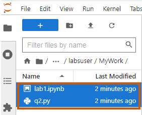

3. Right click on the selected file(s) you wish to download.
4. Select "Download".

    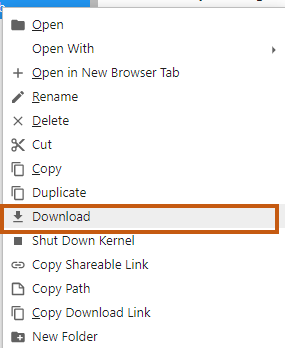


### Downloading from Virtual Desktop

1.	Navigate to **Work WorkSpace** and click the **Reload** icon <u>once</u> to reload the file tree. This step will reload the contents of the work folder.

    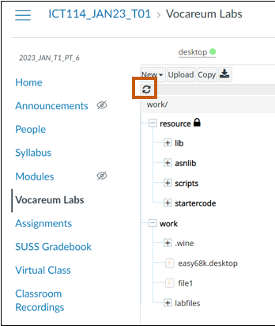

2. Click on the file/folder that you wish to download.

    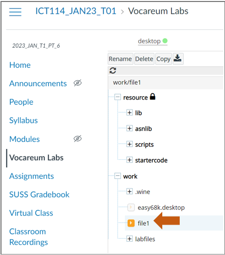

**NOTE**: If you have multiple files/folders to download, you must do it one by one. The recommended way would be to zip up the files/folders into 1 zip file and you download the single zip file.

3. Click on the **Download** icon button.

    

4. The system will automatically compress the selected file/folder into a zip file. Click **Download zipped source** to download the file.

    

---

## How do I upload my project to Vocareum?

### Uploading to VSCode IDE

<u>Method 1</u>

Simply drag and drop your directory into the explorer of IDE on Vocareum. See below.


<u>Method 2</u>

1. Navigate to the directory where you wish to upload your file(s).
2. **Right-click** on an empty area on the file explorer, click **Upload** and select the file(s) that you wish to upload.

   

3. To upload multiple files, hold down on the `Control` button (for Windows) on the keyboard and select the files one by one. The selected files will be highlighted in blue. Click **Open** to upload.

   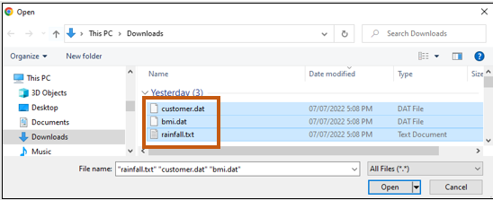

4. Once upload is completed, you can find the file(s) listed under the directory in your IDE.

   

### Uploading to JupyterLab IDE

1. Navigate into the directory you wish to upload to. 
2. Click on the **Upload** icon button and select the file to upload. 
3. To upload multiple files, hold down on the `Control` button (for Windows) on the keyboard and select the files one by one. The selected files will be highlighted in blue. Click **Open** to upload.

     

### Uploading to Virtual Desktop

1. Navigate to **Work Workspace** and click on **work**.

   

2. Click on **Upload** button.

   

3. To upload multiple files, hold down on the `Control` button (for Windows) on the keyboard and select the files one by one. The selected files will be highlighted in blue. Click **Open** to upload.

    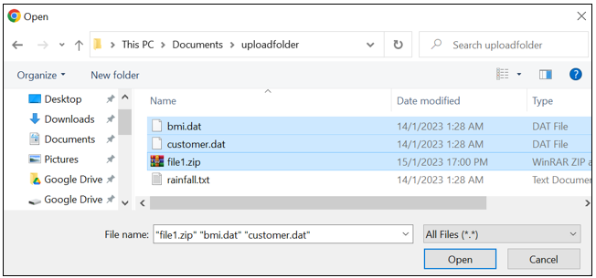

4. System will start to process the upload and will prompt successful when completed.

    

5. Verify that your files have successfully uploaded from the file tree or in your Virtual Desktop.

    

---

## Mongodb is disconnected. I am facing an error trying to reconnect Mongodb.

For a quick fix, run the following commands on your terminal.
```
cd /home/labsuser/dbfiles
rm -rfv WiredTiger.lock mongod.lock
sudo mongod --dbpath /home/labsuser/dbfiles --repair
```

Once you run the above commands, proceed to restart your lab by pressing “End Lab” on the top right corner of your workspace and press “Start Lab” to start it again.


<details>
  <summary>Click for explanation.</summary>  
Usually when this happens, it means that the previous Mongodb run was not logged off properly and the lock file was not removed. The commands above try to remove hte lock file.

</details>

---

## I forgot my password for my mongodb-compass keyring, what can I do?

Reset your password:
1. Open a terminal in the virtual desktop. 
2. run the command: 
    ```
    rm -rfv ~/.local/share/keyrings/Default_keyring.keyring
    ```
3. Close MongoDb compass application
4. Re-launch the MongoDB compass application, accept the default and click **Connect**
5.  The prompt to set the password for a new keyring will appear.
    
6. Enter a new password for the keyring.

---

## How do I copy/paste text from local desktop to virtual desktop?

1. Use Crtl + C keyboard shortcut to copy the text of your choice from your local desktop.
2. Navigate to your virtual desktop and click on the arrow to open the noVNC control panel.

    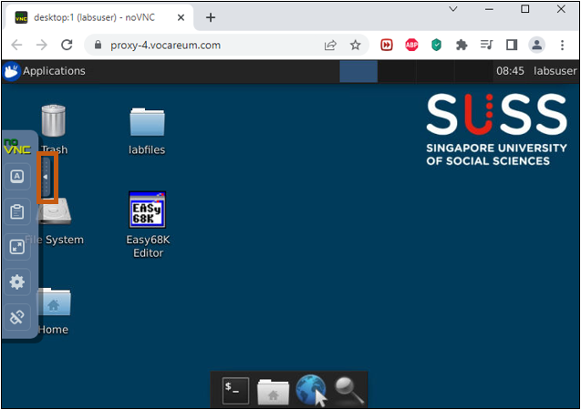

3. CLick on the **Clipboard** button on the noVNC control panel to open the Clipboard.

    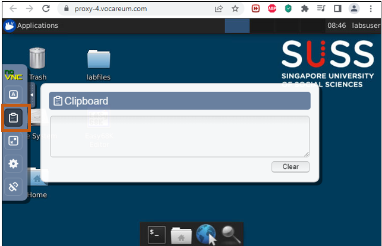

4.	Use Ctrl + V keyboard shortcut to paste the text into the Clipboard.
5.	In your virtual desktop, **right-click** on your mouse and click **Paste** to paste the contents on the application.

    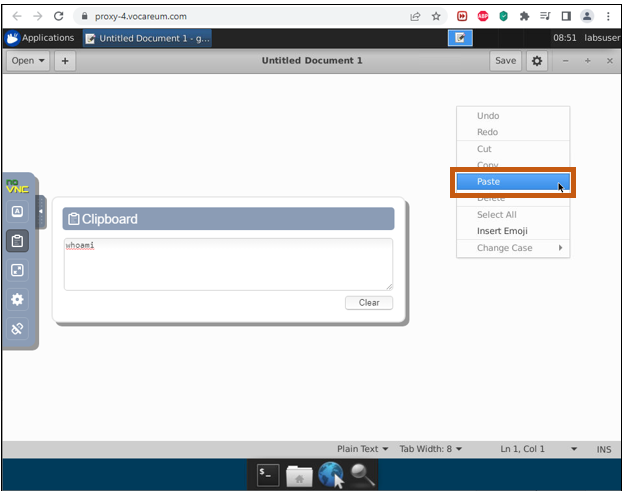
    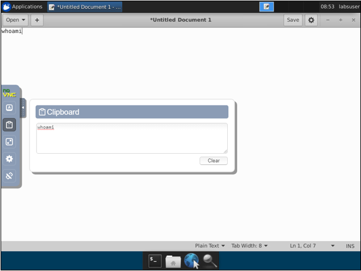

6. Click the arrow on the noVNC control panel to hide it.

    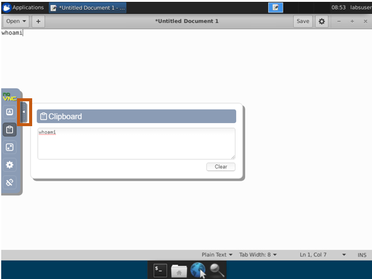

---

## How do I copy/paste text from virtual desktop to local desktop?

1. Highlight the text of your choice which you want to copy to the local desktop.

    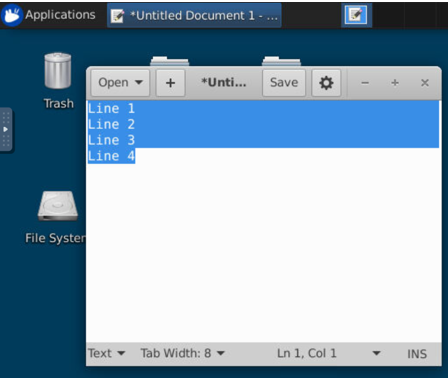

2. Click on the arrow on the left to open the noVNC control panel.
3. CLick on the **Clipboard** button on the noVNC control panel to display the Clipboard.

    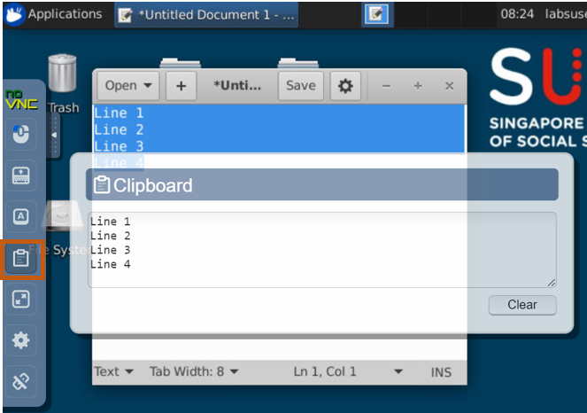

4.	Use the Ctrl + C keyboard shortcut to copy the text in the Clipboard.
5.	Use the Ctrl + V keyboard shortcut to paste the text in your local desktop.

---

## Virtual desktop connection lost

Scenarios of possible issues:

1. Your virtual desktop connection suddenly gets lost, and you are unable to re-connect back to your virtual desktop.

      A sample of the error is shown below.
    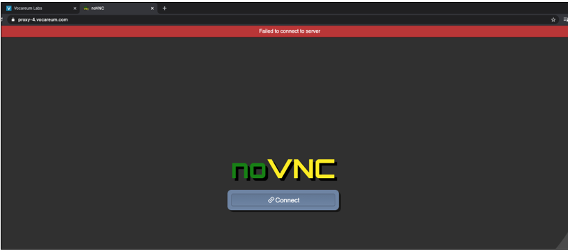


2. The noVNC loading is stuck at the connecting loop indefinitely.


To resolve the issues:

- CLose the noVNC browser tab.
- Navigate back to the **Work Workspace** and end the current session by clicking the **End Lab**.
- Click on **Start Lab** to obtain a new session.
    

---

## Desktop Screensaver Password

For users who come across the virtual desktop screensaver and need the password to unlock it, the password is `labsuser`.

   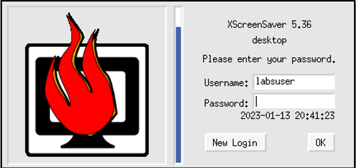

---

## Black box on virtual desktop

If you have selected **“One empty panel”** on the Panel Prompt as shown below, you will get a black box on the desktop.

   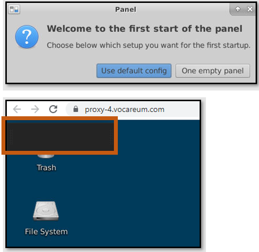

To resolve this issue:
1.	On the virtual desktop, open a terminal.
2.	Once the terminal appears, enter the following command:
      ```
      rm -rf ~/.config/xfce4/
      ```
3.	Navigate back to **Work Workspace** and click **End Lab**
4.	Click **Start Lab** to start the lab again.
5.	Once the lab starts, remember to choose **“Use default config”**

---

## Timeout for Lab Workspace/Lab taking too long to load

If you encounter any of the error messages below after clicking on **My Work**: 

   
   
   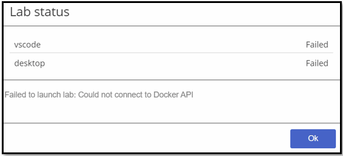

Please close the message prompt box by clicking on **Ok** and click on **Start Lab** again. The lab will continue to load after a short while as it is working hard in the background to load the lab.

---